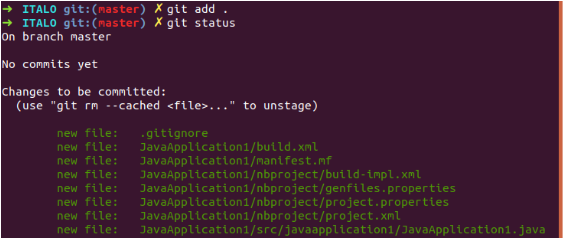
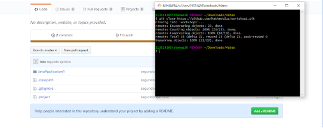

# Lab 1 ARSW GIT Basic Concepts
# workshop1

-Mateo Guzman

-Italo Cufiño Novoa 

Git add .
 - Agrega los nuevos cambios de toda la carpeta
 
 
git commit -m "Message"
 - Se usa para guardar los cambios que se han hecho hasta el momento en el repositorio local, el cual tiene un mensaje que indica que se a hecho.
 
 
git remote add origin <server>
 - Poder adicionar el repositorio creado en git
 

git push origin master
 -Envía los cambio locales al repositorio público.
 
 
git clone <repository>
 -Clona un repositorio en un directorio recién creado.
 
  

git pull origin master
 -Extraerá los cambios desde el repositorio público de la rama maestra o la indicada y los fusionará con la rama local desprotegida.
 
 
 
